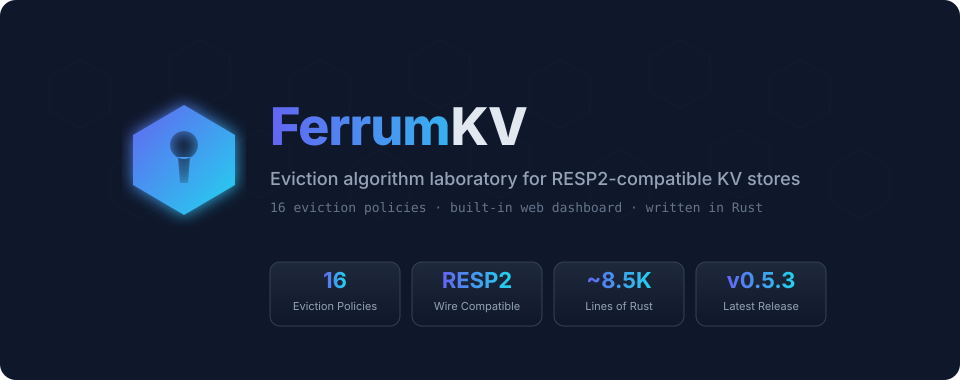
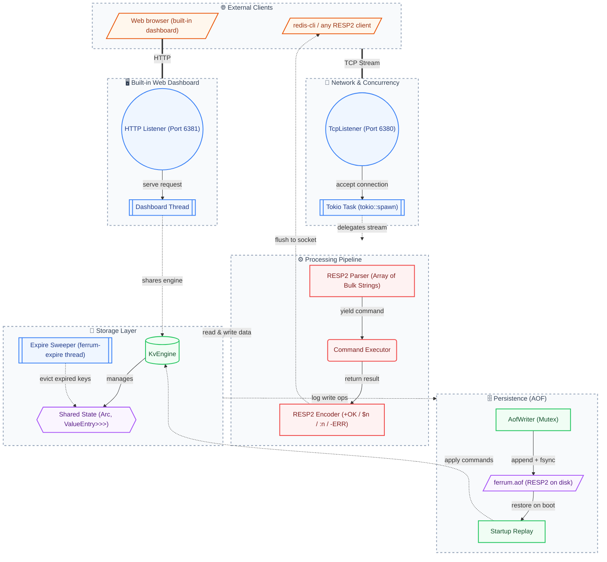

<p align="center">
  
</p>

<p align="center">
  <a href="https://github.com/phaethix/ferrum-kv/releases"></a>
  <a href="./LICENSE"></a>
  <a href="https://github.com/phaethix/ferrum-kv/actions/workflows/ci.yml"></a>
  
</p>

---

## What is FerrumKV?

FerrumKV is an **eviction algorithm laboratory** — a place to study,
benchmark, and experiment with cache eviction strategies. It wraps 16
policies (from classic LRU to the self-tuning AHE) in a working,
RESP2-compatible KV store you can drive with `redis-cli`.

It is **not** a Redis replacement. It is a research vehicle: every
algorithm ships with reproducible benchmarks, every code path is
commented, and the entire ~8,500-line codebase is designed to be read
in an afternoon.

Three principles guide the project:

**🔬 Algorithms first.**
[AHE](./docs/reference/ahe.md) (Adaptive Hybrid Eviction) fuses recency,
frequency, and TTL into a single *Eviction Priority Score* and self-tunes
its weights from live hit-ratio feedback. No knobs, no tuning — swap it
in with `--maxmemory-policy allkeys-ahe` and it adapts. SIEVE (NSDI'24),
SIEVE-S, AdaptiveClimb, and 10 more policies ship alongside it, all
benchmarked against the same workload suite.

**📖 Readable end-to-end.**
~8,500 lines of layered, well-commented Rust — no macro magic, no custom
allocators. TCP → RESP2 parsing → engine → eviction → AOF → Tokio async:
the whole pipeline is followable in an afternoon.

**🔧 Self-contained and Redis-flavoured.**
A single static binary, RESP2-compatible, driven by `redis-cli` and
`redis-benchmark`. 16 eviction policies you can swap at runtime, plus a
zero-dependency web dashboard.

<p align="center">
  
</p>

https://shipthatcode.com/courses/build-redis

## Quick Start

```bash
cargo build --release

# In-memory (default: :6380, dashboard on :6381)
./target/release/ferrum-kv

# With AOF persistence + AHE eviction
./target/release/ferrum-kv \
  --aof-path /tmp/ferrum.aof \
  --maxmemory 256mb \
  --maxmemory-policy allkeys-ahe
```

```text
$ redis-cli -p 6380
redis-cli> SET user:1000 '{"name":"Alice"}'
OK
redis-cli> GET user:1000
{"name":"Alice"}
redis-cli> INFO memory
# Memory
used_memory:184
maxmemory:268435456
...
```

Open **http://127.0.0.1:6381** for the built-in dashboard.

## The Eviction Laboratory

Cache eviction has seen a renaissance since 2024. SIEVE (NSDI'24)
showed that a simple FIFO-derived algorithm can beat 9 state-of-the-art
policies on nearly half of 1,559 production traces. AdaptiveClimb
(arXiv:2511.21235) brought control theory to cache replacement. Cold-RL
put reinforcement learning on the table.

FerrumKV tracks this frontier. Every policy ships with a shared benchmark
harness that measures hit ratio across four workload patterns — Zipfian
(stable skew), shifting hot set, OLTP-mixed, and sequential scan. Switch
policies at runtime with `CONFIG SET maxmemory-policy` and compare results
immediately. No restart, no redeploy.

**AHE** is FerrumKV's flagship: it blends recency, frequency, and TTL into
a self-tuning *Eviction Priority Score*. On every workload pattern it
tracks the better of LRU and LFU, and it never hits either policy's worst
case. LFU's sticky frequency counters collapse to **51.1%** on a shifting
hot set while AHE holds at **52.3%**; under a scan-heavy mix AHE
(**56.8%**) stays clear of LRU's dip to **56.3%**.

📎 [AHE algorithm reference](./docs/reference/ahe.md) ·
[Benchmark methodology](./docs/reference/benchmarks.md) ·
[Reproduce: `scripts/bench-hit-ratio.sh`](scripts/bench-hit-ratio.sh)

<p align="center">
  
</p>

## Dashboard


| Feature | Description |
|---------|-------------|
| Key browser | Glob search (`user:*`, `session?`), paginated list, TTL badges |
| Inline editor | View, edit, set TTL, delete keys — all in-browser |
| Live stats | Keys, memory, hit ratio, eviction policy — auto-refresh every 2s |
| Command console | Run any RESP command (`GET`, `SET`, `INFO`, …) with syntax highlighting |

## Eviction Policies

| Policy | Type | Recency | Frequency | TTL | Self-Tuning |
|--------|------|:-------:|:---------:|:---:|:-----------:|
| `noeviction` | — | | | | |
| `allkeys-lru` / `volatile-lru` | LRU | ✓ | | ✓ | |
| `allkeys-lfu` / `volatile-lfu` | LFU | | ✓ | ✓ | |
| `allkeys-random` / `volatile-random` | Random | | | ✓ | |
| `volatile-ttl` | TTL | | | ✓ | |
| `allkeys-sieve` / `volatile-sieve` | SIEVE (NSDI'24) | ✓ | | | |
| **`allkeys-sieves`** / **`volatile-sieves`** | SIEVE-S (FerrumKV) | ✓ | | ✓ | |
| **`allkeys-adaptiveclimb`** / **`volatile-adaptiveclimb`** | AdaptiveClimb (arXiv:2511.21235) | ✓ | ✓ | | ✓ |
| **`allkeys-ahe`** / **`volatile-ahe`** | Adaptive | ✓ | ✓ | ✓ | ✓ |

Policies marked **bold** are unique to FerrumKV or adapted from recent
research. All policies are benchmarked against the same four-pattern
workload suite. See [benchmarks](#benchmarks) below.

<p align="center">
  
</p>

## Benchmarks

Apple M5 (10 cores), loopback, `redis-benchmark -n 100000 -c 50`:

| Scenario | SET QPS | GET QPS | p50 Latency |
|----------|--------:|--------:|------------:|
| Baseline (no eviction) | 62,189 | 65,231 | 0.42ms |
| Pipelined `-P 16` | 350,877 | 378,787 | 1.06ms |
| LFU (16MB cap) | 57,339 | 61,690 | 0.42ms |
| AHE (16MB cap) | 59,559 | 50,787 | 0.42ms |

Full report: [`benches/redis-benchmark.md`](benches/redis-benchmark.md)

### Hit ratio — the metric that matters

Throughput tells you how fast the engine serves requests. Hit ratio
tells you how well the eviction algorithm keeps the working set cached.
Measured end-to-end against a live, memory-capped server (working set
**100,000 keys**, cache capped at **5,000 entries ≈ 590 KiB**):

| Policy | `zipf` (stable skew) | `shift` (rotating hot set) | `mixed` (OLTP-like) | `scan` (sequential) |
|--------|---------------------:|---------------------------:|---------------------:|--------------------:|
| `allkeys-lru` | 59.5% | 52.4% | 56.3% | 0.0% |
| `allkeys-lfu` | 59.4% | 51.1% | 58.0% | 0.0% |
| `allkeys-ahe` | 59.5% | 52.3% | 56.8% | 0.0% |
| `allkeys-random` | 57.1% | 52.4% | 54.5% | 0.0% |

**AHE is the no-regret choice.** On every pattern it tracks the better of
LRU and LFU and never hits either policy's worst case: LFU's sticky
frequency counters collapse to **51.1%** on a shifting hot set while AHE
holds at **52.3%**, and under a scan-heavy mix AHE (**56.8%**) stays clear
of LRU's dip to **56.3%** and `random`'s **54.5%** floor.

Method and a TTL-intensive pattern: [`docs/reference/benchmarks.md`](docs/reference/benchmarks.md).
Reproduce: `scripts/bench-hit-ratio.sh` (harness: [`examples/hit_ratio_bench.rs`](examples/hit_ratio_bench.rs)).
Figures vary ~±1 pp across runs (internal LFU/LRU sampling RNG seeded from wall clock).

## Architecture


```mermaid
flowchart TB
    classDef runtime fill:#f8fafc,stroke:#94a3b8,stroke-width:2px,color:#334155,stroke-dasharray: 5 5
    classDef engine fill:#eff6ff,stroke:#3b82f6,stroke-width:2px,color:#1e3a8a
    classDef entity fill:#fef2f2,stroke:#ef4444,stroke-width:2px,color:#7f1d1d
    classDef resource fill:#f0fdf4,stroke:#22c55e,stroke-width:2px,color:#14532d
    classDef config fill:#faf5ff,stroke:#a855f7,stroke-width:2px,color:#581c87
    classDef ext fill:#fff7ed,stroke:#ea580c,stroke-width:2px,color:#9a3412

    subgraph ClientLayer ["🌐 External Clients"]
        direction LR
        Client[/"redis-cli / any RESP2 client"/]
        Browser[/"Web browser (built-in dashboard)"/]
    end

    subgraph NetLayer ["🔌 Network & Concurrency"]
        direction LR
        Listener(("TcpListener (Port 6380)"))
        WorkerThread[["Tokio Task (tokio::spawn)"]]

        Listener -->|"accept connection"| WorkerThread
    end

    subgraph DashLayer ["🖥️ Built-in Web Dashboard"]
        direction LR
        Http(("HTTP Listener (Port 6381)"))
        HttpThread[["Dashboard Thread"]]

        Http -->|"serve request"| HttpThread
    end

    subgraph ProcessLayer ["⚙️ Processing Pipeline"]
        direction LR
        Parser["RESP2 Parser (Array of Bulk Strings)"]
        Exec("Command Executor")
        Encoder["RESP2 Encoder (+OK / $n / :n / -ERR)"]

        Parser -->|"yield command"| Exec
        Exec -->|"return result"| Encoder
    end

    subgraph StoreLayer ["💾 Storage Layer"]
        direction LR
        Engine[("KvEngine")]
        State{{"Shared State (Arc<RwLock<HashMap<Vec<u8>, ValueEntry>>>)"}}
        ExpireW[["Expire Sweeper (ferrum-expire thread)"]]

        Engine -->|"manages"| State
        ExpireW -.->|"evict expired keys"| State
    end

    subgraph PersistLayer ["🗄️ Persistence (AOF)"]
        direction LR
        AofWriter["AofWriter (Mutex<File>)"]
        AofFile[/"ferrum.aof (RESP2 on disk)"/]
        Replay["Startup Replay"]

        AofWriter -->|"append + fsync"| AofFile
        AofFile -->|"restore on boot"| Replay
    end

    ClientLayer == "TCP Stream" === NetLayer
    Browser == "HTTP" === DashLayer
    WorkerThread -.->|"delegates stream"| ProcessLayer
    HttpThread -.->|"shares engine"| Engine
    ProcessLayer == "read & write data" === StoreLayer
    StoreLayer -.->|"log write ops"| PersistLayer
    Replay -.->|"apply commands"| Engine
    Encoder -.->|"flush to socket"| Client

    class ClientLayer,NetLayer,ProcessLayer,StoreLayer,PersistLayer,DashLayer runtime
    class Client,Browser ext
    class Listener,WorkerThread,Http,HttpThread,ExpireW engine
    class Parser,Exec,Encoder entity
    class Engine,AofWriter,Replay resource
    class State,AofFile config
```

## CLI Flags

| Flag | Default | Description |
|------|---------|-------------|
| `--config PATH` | *(none)* | Load a config file |
| `--addr HOST:PORT` | `127.0.0.1:6380` | RESP listening address |
| `--dashboard-addr ADDR\|off` | `127.0.0.1:6381` | Web dashboard address, or `off` to disable |
| `--aof-path PATH` | *(disabled)* | Enable AOF persistence |
| `--appendfsync POLICY` | `everysec` | `always` / `everysec` / `no` |
| `--client-timeout SECONDS` | `0` (disabled) | Per-connection idle timeout |
| `--maxclients N` | *(unlimited)* | Max concurrent client connections |
| `--maxmemory BYTES` | `0` (unlimited) | Memory cap (`512b` / `64kb` / `256mb` / `1gb`) |
| `--maxmemory-policy POLICY` | `noeviction` | Any of the 16 policies |
| `--maxmemory-samples N` | `5` | Keys sampled per eviction round |
| `--io-threads N` | `0` (auto) | Tokio worker threads |
| `--loglevel LEVEL` | `info` | `off` / `error` / `warn` / `info` / `debug` / `trace` |

Config file: [`ferrum.conf.example`](ferrum.conf.example). All flags: `ferrum-kv --help`.

## Contributing

```bash
git clone https://github.com/phaethix/ferrum-kv.git
cd ferrum-kv

cargo fmt --check && cargo clippy --all-targets -- -D warnings && cargo test --all-targets
```

See [CONTRIBUTING.md](CONTRIBUTING.md) for conventions and review process.

## Roadmap

| Version | Focus |
|---------|-------|
| v0.5.1 | CONFIG SET/GET, AUTH requirepass; SIEVE, SIEVE-S, AdaptiveClimb, AHE TTL-aware eviction, benchmark suite |
| v0.5.2 | SLOWLOG, AOF REWRITE / BGREWRITEAOF |
| v0.5.3 | MONITOR, INFO fields expansion, WriteGuard refactor |
| v0.6 | RESP3 protocol, typed replies, client-side caching |
| v0.7 | List, Hash, Set data types |

Full roadmap: [`docs/design/product-strategy.md`](docs/design/product-strategy.md)

---

<p align="center">
  <sub>MIT License · <a href="./LICENSE">LICENSE</a></sub>
</p>
