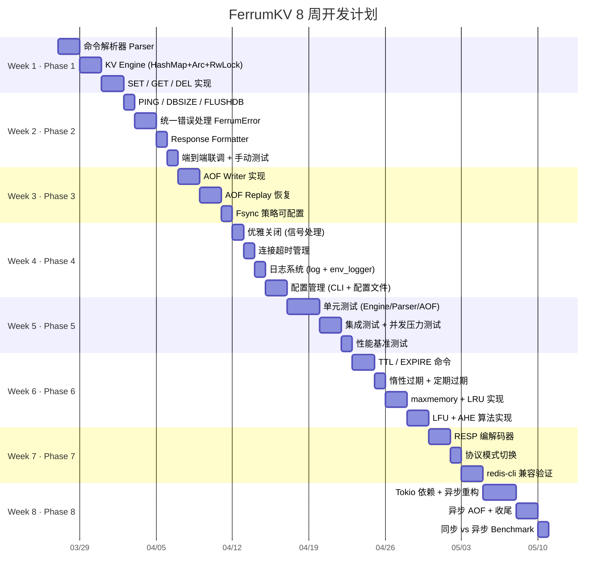
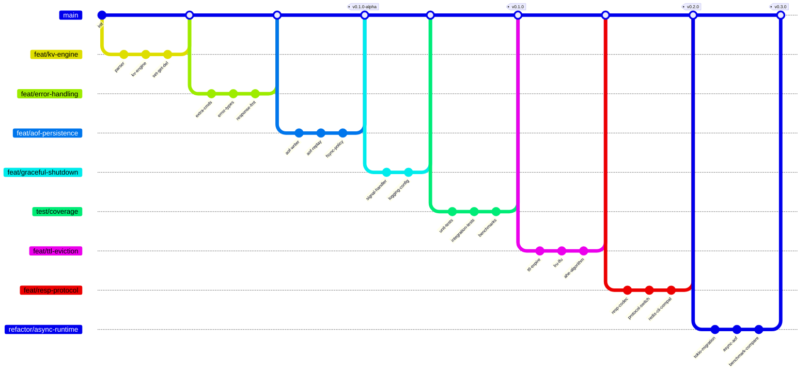
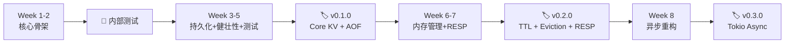

# FerrumKV 开发计划

> 📅 计划周期：2 个月（8 周）
> ⏰ 每日投入：1~1.5 小时（工作日），周末可弹性加码
> 🎯 目标：完成白皮书 Phase 1 ~ Phase 8 全部功能

---

## 📊 总览



---

## 🌿 Git 分支策略

### 分支模型



### 分支命名规范

**前缀规则**：
- `feat/` — 新功能开发
- `test/` — 测试相关
- `refactor/` — 重构改造
- `fix/` — 缺陷修复（按需创建）
- `docs/` — 文档更新（按需创建）

### 分支命名一览

| 周次 | Phase | 分支名 | 功能描述 | 合并后 Tag |
| ---- | ----- | ------ | -------- | ---------- |
| Week 1 | Phase 1 · 核心骨架 | `feat/kv-engine` | KV 存储引擎 + 命令解析器 | — |
| Week 2 | Phase 2 · 功能完整 | `feat/error-handling` | 统一错误处理 + 响应格式化 | — |
| Week 3 | Phase 3 · 持久化 | `feat/aof-persistence` | AOF 写入 / 重放 / Fsync | `v0.1.0-alpha` |
| Week 4 | Phase 4 · 健壮性 | `feat/graceful-shutdown` | 优雅关闭 + 日志 + 配置管理 | — |
| Week 5 | Phase 5 · 质量保障 | `test/coverage` | 单元测试 + 集成测试 + 基准测试 | **`v0.1.0`** |
| Week 6 | Phase 6 · 内存管理 | `feat/ttl-eviction` | TTL 过期 + LRU/LFU/AHE 淘汰 | — |
| Week 7 | Phase 7 · RESP 协议 | `feat/resp-protocol` | RESP 编解码 + redis-cli 兼容 | **`v0.2.0`** |
| Week 8 | Phase 8 · 异步运行时 | `refactor/async-runtime` | Tokio 异步重构 | **`v0.3.0`** |

### 分支操作流程

每周开始时：
```bash
# 1. 确保 main 是最新的
git checkout main
git pull origin main

# 2. 创建本周分支（以 Week 1 为例）
git checkout -b feat/kv-engine
```

每周结束时：
```bash
# 1. 确保所有测试通过
cargo test

# 2. 合并回 main（以 Week 1 为例）
git checkout main
git merge --no-ff feat/kv-engine -m "feat: implement core KV engine with command parser"

# 3. 如果是版本节点，打 tag
git tag -a v0.1.0 -m "Core KV Engine + AOF + Tests"

# 4. 推送
git push origin main --tags
```

### 临时分支（可选）

如果某个 Phase 内部任务较大，可以从 Phase 分支再切子分支：

```bash
# 例如 Week 6 工作量大，可以拆分
git checkout feat/ttl-eviction
git checkout -b feat/ttl-expire          # 子任务：TTL 过期机制
git checkout -b feat/lru-lfu             # 子任务：LRU/LFU 淘汰
git checkout -b feat/ahe-algorithm       # 子任务：AHE 自适应算法
```

---

## 📌 当前进度

| 项目 | 状态 |
| ---- | ---- |
| TCP Server 监听 | ✅ 已完成 |
| 多线程连接处理 | ✅ 已完成 |
| PING / HELLO 命令 | ✅ 已完成（简单版） |
| 命令解析器 | ❌ 未开始 |
| KV Engine | ❌ 未开始 |
| 其余所有功能 | ❌ 未开始 |

---

## 🗓️ 每周详细计划

### Week 1（Phase 1 · 核心骨架）

> 🌿 分支：`feat/kv-engine`

> 🎯 目标：实现最小可用的 KV 存储，能通过 nc 进行 SET/GET/DEL

| 天 | 任务 | 产出 | 预计时间 |
| -- | ---- | ---- | -------- |
| Day 1 | 搭建模块结构，创建 `network/`、`protocol/`、`storage/`、`error/` 目录 | 项目骨架 | 30min |
| Day 1 | 实现 `protocol::parser` —— 将原始字符串解析为 `Command` 枚举 | `Command::Set/Get/Del/Ping/Unknown` | 30min |
| Day 2 | 实现 `storage::engine` —— `KvEngine` 结构体封装 `Arc<RwLock<HashMap>>` | `set()`、`get()`、`del()` 方法 | 45min |
| Day 3 | 将 Parser + Engine 集成到 `main.rs` 的连接处理中 | 可通过 nc 执行 SET/GET/DEL | 45min |
| Day 4 | 代码整理 + 手动测试多客户端并发读写 | 确认并发安全 | 30min |

**关键文件变更**：
```
src/protocol/parser.rs   ← 新建
src/storage/engine.rs    ← 新建
src/error/mod.rs         ← 新建
src/main.rs              ← 重构
```

**验证方式**：
```bash
# Terminal 1
cargo run

# Terminal 2
echo "SET name ferrum" | nc 127.0.0.1 6380
echo "GET name" | nc 127.0.0.1 6380        # => ferrum
echo "DEL name" | nc 127.0.0.1 6380        # => OK
echo "GET name" | nc 127.0.0.1 6380        # => NULL
```

---

### Week 2（Phase 2 · 功能完整）

> 🌿 分支：`feat/error-handling`

> 🎯 目标：补齐基础命令，统一错误处理，响应格式规范化

| 天 | 任务 | 产出 | 预计时间 |
| -- | ---- | ---- | -------- |
| Day 1 | 实现 PING / DBSIZE / FLUSHDB 命令 | 扩展 Command 枚举 + Engine 方法 | 30min |
| Day 2 | 定义 `FerrumError` 枚举，实现 `From<io::Error>` 等转换 | 统一错误类型 | 45min |
| Day 3 | 将所有 `unwrap()` 替换为 `?` 操作符 + 错误传播 | 健壮的错误处理链 | 45min |
| Day 4 | 实现 Response Formatter，统一响应格式 | `OK` / `NULL` / `ERR <msg>` | 30min |
| Day 5 | 端到端联调，手动测试所有命令 + 异常输入 | 功能验证通过 | 30min |

**关键设计决策**：
- `FerrumError` 使用 `thiserror` crate 还是手动实现 `Display + Error`？
  - 建议：先手动实现（学习 trait），后续可切换到 `thiserror`

---

### Week 3（Phase 3 · 持久化）

> 🌿 分支：`feat/aof-persistence`

> 🎯 目标：实现 AOF 持久化，服务重启后数据不丢失

| 天 | 任务 | 产出 | 预计时间 |
| -- | ---- | ---- | -------- |
| Day 1 | 实现 `persistence::aof` —— AOF Writer（`Mutex<File>` 追加写入） | 写命令自动追加到 `.aof` 文件 | 45min |
| Day 2 | 将 AOF Writer 集成到 Engine 的 SET/DEL 流程中 | 每次写操作自动记录 | 45min |
| Day 3 | 实现 AOF Replay Loader —— 启动时逐行读取并重放 | 重启后数据恢复 | 45min |
| Day 4 | 实现 Fsync 策略（Always / EverySecond / No） | 可配置的刷盘策略 | 45min |
| Day 5 | 测试：写入 → 重启 → 验证数据恢复 | 持久化验证通过 | 30min |

**验证方式**：
```bash
# 写入数据
echo "SET a 1" | nc 127.0.0.1 6380
echo "SET b 2" | nc 127.0.0.1 6380

# 查看 AOF 文件
cat ferrum.aof
# => SET a 1
# => SET b 2

# 重启服务
cargo run

# 验证恢复
echo "GET a" | nc 127.0.0.1 6380  # => 1
echo "GET b" | nc 127.0.0.1 6380  # => 2
```

---

### Week 4（Phase 4 · 健壮性）

> 🌿 分支：`feat/graceful-shutdown`

> 🎯 目标：生产级健壮性——优雅关闭、超时管理、日志、配置

| 天 | 任务 | 产出 | 预计时间 |
| -- | ---- | ---- | -------- |
| Day 1 | 信号处理（SIGINT/SIGTERM）+ `AtomicBool` shutdown flag | Ctrl+C 优雅关闭 | 45min |
| Day 2 | 连接超时管理（`set_read_timeout` / `set_write_timeout`） | 僵尸连接自动断开 | 30min |
| Day 3 | 集成 `log` + `env_logger`，替换所有 `println!` | 结构化日志输出 | 45min |
| Day 4 | 实现 `config::settings` —— 配置文件解析 + 命令行参数 | `ferrum.conf` 支持 | 60min |
| Day 5 | 实现 `max_connections` 限制 | 连接数控制 | 30min |

**新增依赖**：
```toml
[dependencies]
log = "0.4"
env_logger = "0.11"
```

---

### Week 5（Phase 5 · 质量保障）

> 🌿 分支：`test/coverage`

> 🎯 目标：完善测试体系，确保核心功能稳定可靠

| 天 | 任务 | 产出 | 预计时间 |
| -- | ---- | ---- | -------- |
| Day 1 | Parser 单元测试（合法/非法命令、边界情况） | `#[cfg(test)]` 模块 | 45min |
| Day 2 | Engine 单元测试（SET/GET/DEL/DBSIZE/FLUSHDB 正确性） | Engine 测试覆盖 | 45min |
| Day 3 | AOF 单元测试（写入格式、重放正确性、损坏行跳过） | AOF 测试覆盖 | 45min |
| Day 4 | 集成测试（端到端 TCP 测试、多客户端并发） | `tests/` 目录 | 60min |
| Day 5 | 并发压力测试 + 简单性能基准 | 压测脚本 + 结果记录 | 45min |

**测试命令**：
```bash
cargo test                    # 全部单元测试
cargo test --test integration # 集成测试
```

> 💡 **里程碑检查点**：Week 5 结束时，v0.1 核心功能应该完全稳定。这是一个很好的 git tag 节点。
>
> ```bash
> git tag -a v0.1.0 -m "Core KV Engine + AOF + Tests"
> ```

---

### Week 6（Phase 6 · 内存管理与键过期）

> 🌿 分支：`feat/ttl-eviction`

> 🎯 目标：实现 TTL 过期、LRU/LFU/AHE 缓存淘汰

| 天 | 任务 | 产出 | 预计时间 |
| -- | ---- | ---- | -------- |
| Day 1 | 升级 `ValueEntry` 结构体（添加 `created_at`、`last_accessed`、`expire_at`） | 存储结构升级 | 45min |
| Day 2 | 实现 EXPIRE / TTL 命令 + 惰性过期（GET 时检查） | 键过期基础功能 | 60min |
| Day 3 | 实现定期过期（后台线程周期扫描） | 主动清理过期键 | 45min |
| Day 4 | 实现 `maxmemory` 配置 + Memory Tracker | 内存使用追踪 | 30min |
| Day 4 | 实现 LRU 淘汰（HashMap + 双向链表） | LRU 策略可用 | 60min |
| Day 5 | 实现 LFU 淘汰（频率桶） | LFU 策略可用 | 60min |
| Day 6 | 实现 AHE 自适应混合淘汰算法（EPS 评分 + α 自适应） | AHE 策略可用 | 90min |
| Day 7 | 淘汰策略单元测试 + 集成验证 | 测试覆盖 | 45min |

> ⚠️ 本周工作量较大，建议周末多投入一些时间。AHE 算法是本项目的创新亮点，值得多花时间打磨。

---

### Week 7（Phase 7 · RESP 协议兼容）

> 🌿 分支：`feat/resp-protocol`

> 🎯 目标：支持 RESP 协议，可用 redis-cli 直接连接

| 天 | 任务 | 产出 | 预计时间 |
| -- | ---- | ---- | -------- |
| Day 1 | 实现 RESP 解析器（读取 `*`、`$`、`+`、`-`、`:` 前缀） | RESP 请求解码 | 60min |
| Day 2 | 实现 RESP 响应编码器（Simple String / Error / Integer / Bulk String / Null） | RESP 响应编码 | 45min |
| Day 3 | 实现协议自动检测（首字节 `*` → RESP，否则 → Simple） | 双协议共存 | 45min |
| Day 4 | redis-cli 连接测试 + 修复兼容性问题 | redis-cli 可用 | 60min |
| Day 5 | redis-benchmark 性能测试 | 性能数据 | 30min |

**验证方式**：
```bash
# 启动 RESP 模式
cargo run -- --protocol-mode resp

# 使用 redis-cli 连接
redis-cli -p 6380
127.0.0.1:6380> SET hello world
OK
127.0.0.1:6380> GET hello
"world"
127.0.0.1:6380> DBSIZE
(integer) 1
```

---

### Week 8（Phase 8 · 异步运行时 + 收尾）

> 🌿 分支：`refactor/async-runtime`

> 🎯 目标：引入 Tokio 异步重构，完成项目收尾

| 天 | 任务 | 产出 | 预计时间 |
| -- | ---- | ---- | -------- |
| Day 1 | 添加 Tokio 依赖，`main()` → `#[tokio::main]` | 异步入口 | 30min |
| Day 2 | `TcpListener` → `tokio::net::TcpListener`，`thread::spawn` → `tokio::spawn` | 异步网络层 | 60min |
| Day 3 | `BufReader` → `tokio::io::BufReader`，异步读写 | 异步 IO | 60min |
| Day 4 | AOF 异步写入（`tokio::fs`） | 异步持久化 | 45min |
| Day 5 | 同步 vs 异步性能对比 Benchmark | 性能对比报告 | 45min |
| Day 6 | 代码清理、注释完善、最终测试 | 项目收尾 | 60min |

**新增依赖**：
```toml
[dependencies]
tokio = { version = "1", features = ["full"] }
```

> 💡 **最终里程碑**：
> ```bash
> git tag -a v0.3.0 -m "Async runtime with Tokio"
> ```

---

## 🏷️ 版本发布节点



| 版本 | 时间节点 | 包含内容 |
| ---- | -------- | -------- |
| 内部测试 | Week 2 末 | Phase 1 + 2（基础 KV 可用） |
| **v0.1.0** | **Week 5 末** | Phase 1~5（核心功能 + AOF + 测试） |
| **v0.2.0** | **Week 7 末** | Phase 6~7（TTL + 淘汰 + RESP） |
| **v0.3.0** | **Week 8 末** | Phase 8（Tokio 异步运行时） |

---

## ⚡ 每日开发节奏建议

```
┌─────────────────────────────────────────────┐
│  📖 5min   回顾昨天进度 + 今天任务          │
│  💻 45min  核心编码                          │
│  🧪 10min  运行测试 / 手动验证              │
│  📝 5min   git commit + 记录进度            │
│  ─────────────────────────────────────────  │
│  总计：~65min / 天                           │
└─────────────────────────────────────────────┘
```

**Git 提交规范**：
```
feat: implement SET/GET/DEL commands
fix: handle empty command input
refactor: extract parser into separate module
test: add unit tests for KV engine
docs: update whitepaper with AHE algorithm
```

---

## 🚨 风险与应对

| 风险 | 概率 | 应对策略 |
| ---- | ---- | -------- |
| Week 6 工作量过大（TTL + 3 种淘汰算法） | 高 | AHE 可延后到 Week 7 前半段，与 RESP 并行推进 |
| Rust 生命周期/借用问题卡壳 | 中 | 先用 `clone()` 跑通，后续优化；善用 `Arc`/`Rc` |
| 异步重构改动面大 | 中 | 保留同步版本分支，异步在新分支开发 |
| 某天没时间写代码 | 高 | 周末补进度，保持周维度的节奏即可 |
| RESP 协议细节复杂 | 低 | 只支持 5 种基础类型，不追求完整兼容 |

---

## 📋 每周 Checklist 模板

每周开始时复制此模板，跟踪进度：

```markdown
### Week N Checklist

- [ ] 任务 1
- [ ] 任务 2
- [ ] 任务 3
- [ ] 本周测试全部通过
- [ ] 代码已提交并推送
- [ ] 回顾：本周学到了什么？
- [ ] 下周预告：需要提前了解什么？
```

---

## 🧭 开发优先级原则

1. **先跑通，再优化** —— 先用最简单的方式实现功能，确认正确后再重构
2. **先测试，再继续** —— 每完成一个模块，立即写测试验证
3. **先同步，再异步** —— Phase 1~7 用同步模型，Phase 8 再引入 Tokio
4. **先核心，再扩展** —— SET/GET/DEL 优先，EXPIRE/TTL/LRU 后续
5. **每天提交** —— 保持小步快跑的节奏，避免大量代码堆积

---

*Last updated: 2026-03-26*
