# FerrumKV 白皮书

---

## 文档信息

| 项目       | 值                                                                 |
| ---------- | ------------------------------------------------------------------ |
| 项目名称   | FerrumKV                                                           |
| 版本       | 0.1.0                                                              |
| 最后更新   | 2026-03-26                                                         |
| 状态       | In Progress                                                        |
| 仓库       | [ferrum-kv](https://github.com/huanyuli/ferrum-kv)                 |

---

## 术语表

| 术语   | 说明                                             |
| ------ | ------------------------------------------------ |
| KV     | Key-Value，键值对存储模型                        |
| AOF    | Append-Only File，追加写日志持久化策略           |
| RESP   | Redis Serialization Protocol，Redis 序列化协议   |
| OOM    | Out Of Memory，内存溢出                          |
| QPS    | Queries Per Second，每秒查询数                   |
| fsync  | 强制将文件缓冲区数据刷写到磁盘的系统调用        |
| LRU    | Least Recently Used，最近最少使用淘汰策略        |
| LFU    | Least Frequently Used，最不经常使用淘汰策略      |
| TTL    | Time To Live，键的存活时间                       |
| Tokio  | Rust 异步运行时框架                              |
| AHE    | Adaptive Hybrid Eviction，自适应混合淘汰算法     |
| EPS    | Eviction Priority Score，淘汰优先级分数          |

---

## 1. 项目概述

FerrumKV 是一个基于 Rust 实现的轻量级 Key-Value 存储系统，用于学习存储引擎、网络编程与并发模型设计。

> **Ferrum**（拉丁语：铁）—— 寓意坚固、高效、可靠。

### 设计目标

- **可运行** —— 开箱即用的 TCP KV 服务
- **可测试** —— 完善的单元测试与集成测试
- **可扩展** —— 清晰的分层架构，便于功能迭代

### 定义

> A lightweight KV storage engine written in Rust for system programming practice.

---

## 2. 功能目标

### 2.1 核心功能

| 功能             | 说明                                |
| ---------------- | ----------------------------------- |
| `SET key value`  | 设置键值对                          |
| `GET key`        | 获取指定 key 的值                   |
| `DEL key`        | 删除指定 key                        |
| `PING`           | 健康检查                            |
| `DBSIZE`         | 返回当前存储的键数量                |
| `FLUSHDB`        | 清空所有数据                        |
| `EXPIRE key secs` | 设置键的过期时间（秒）            |
| `TTL key`        | 查询键的剩余存活时间                |
| 多客户端并发访问 | 支持多个 TCP 客户端同时读写         |
| AOF 持久化       | 写命令追加日志，保障数据持久性      |
| 重启恢复         | 启动时重放 AOF 日志，恢复内存状态   |
| LRU 缓存淘汰     | 内存超限时自动淘汰最近最少使用的键  |
| RESP 协议子集    | 兼容 redis-cli 连接与基本交互       |
| 异步运行时       | 基于 Tokio 的高性能异步网络模型     |

### 2.2 非目标

- ❌ 分布式系统（建议独立项目 `ferrum-cluster`）
- ❌ Raft / 一致性协议（建议独立项目 `ferrum-raft`）
- ❌ Redis 全协议兼容（仅支持 RESP 子集，不追求 200+ 命令全覆盖）

### 2.3 演进目标

以下特性将在核心功能稳定后分阶段纳入：

| 特性 | 目标版本 | 说明 |
| ---- | -------- | ---- |
| LRU / LFU 缓存淘汰 | v0.2 | 内存管理，防止 OOM |
| RESP 协议子集 | v0.2 | 兼容 redis-cli / redis-benchmark |
| async runtime（Tokio） | v0.3 | 异步网络模型，提升并发性能 |
| TTL / EXPIRE 键过期 | v0.2 | 键级别的生命周期管理 |

---

## 3. 系统分层架构

### 3.1 全局分层架构图

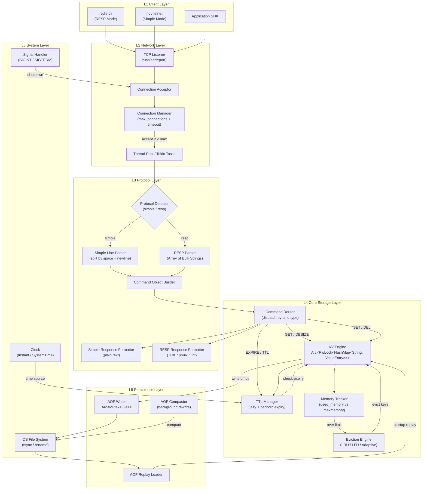
```mermaid
flowchart TB
    subgraph L1["L1 Client Layer"]
        C1["redis-cli<br/>(RESP Mode)"]
        C2["nc / telnet<br/>(Simple Mode)"]
        C3["Application SDK"]
    end

    subgraph L2["L2 Network Layer"]
        N1["TCP Listener<br/>bind(addr:port)"]
        N2["Connection Acceptor"]
        N3["Thread Pool / Tokio Tasks"]
        N4["Connection Manager<br/>(max_connections + timeout)"]
    end

    subgraph L3["L3 Protocol Layer"]
        P1{"Protocol Detector<br/>(simple / resp)"}
        P1A["Simple Line Parser<br/>(split by space + newline)"]
        P1B["RESP Parser<br/>(Array of Bulk Strings)"]
        P2["Command Object Builder"]
        P3A["Simple Response Formatter<br/>(plain text)"]
        P3B["RESP Response Formatter<br/>(+OK / $bulk / :int)"]
    end

    subgraph L4["L4 Core Storage Layer"]
        S1["Command Router<br/>(dispatch by cmd type)"]
        S2["KV Engine<br/>Arc&lt;RwLock&lt;HashMap&lt;String, ValueEntry&gt;&gt;&gt;"]
        S3["TTL Manager<br/>(lazy + periodic expiry)"]
        S4["Eviction Engine<br/>(LRU / LFU / Adaptive)"]
        S5["Memory Tracker<br/>(used_memory vs maxmemory)"]
    end

    subgraph L5["L5 Persistence Layer"]
        P5["AOF Writer<br/>Arc&lt;Mutex&lt;File&gt;&gt;"]
        P6["AOF Replay Loader"]
        P7["AOF Compactor<br/>(background rewrite)"]
    end

    subgraph L6["L6 System Layer"]
        SYS1["OS File System<br/>(fsync / rename)"]
        SYS2["Signal Handler<br/>(SIGINT / SIGTERM)"]
        SYS3["Clock<br/>(Instant / SystemTime)"]
    end

    C1 --> N1
    C2 --> N1
    C3 --> N1
    N1 --> N2
    N2 --> N4
    N4 -->|"accept if < max"| N3
    N3 --> P1
    P1 -->|simple| P1A
    P1 -->|resp| P1B
    P1A --> P2
    P1B --> P2
    P2 --> S1
    S1 -->|"GET / DBSIZE"| S2
    S1 -->|"SET / DEL"| S2
    S1 -->|"EXPIRE / TTL"| S3
    S2 --> S3
    S2 --> S5
    S5 -->|"over limit"| S4
    S4 -->|"evict keys"| S2
    S3 -->|"check expiry"| S2
    S1 --> P3A
    S1 --> P3B
    S2 -->|"write cmds"| P5
    P5 --> SYS1
    SYS1 --> P6
    P6 -->|"startup replay"| S2
    P7 -->|"compact"| SYS1
    SYS2 -->|"shutdown"| N2
    SYS3 -->|"time source"| S3
```

### 3.2 请求完整生命周期（SET 命令）

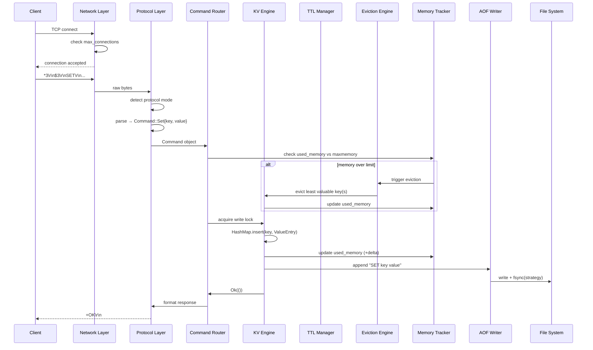
```mermaid
sequenceDiagram
    participant Client
    participant Network as Network Layer
    participant Protocol as Protocol Layer
    participant Router as Command Router
    participant Engine as KV Engine
    participant TTL as TTL Manager
    participant Eviction as Eviction Engine
    participant Memory as Memory Tracker
    participant AOF as AOF Writer
    participant Disk as File System

    Client->>Network: TCP connect
    Network->>Network: check max_connections
    Network-->>Client: connection accepted

    Client->>Network: *3\r\n$3\r\nSET\r\n...
    Network->>Protocol: raw bytes
    Protocol->>Protocol: detect protocol mode
    Protocol->>Protocol: parse → Command::Set{key, value}
    Protocol->>Router: Command object

    Router->>Memory: check used_memory vs maxmemory
    alt memory over limit
        Memory->>Eviction: trigger eviction
        Eviction->>Engine: evict least valuable key(s)
        Engine->>Memory: update used_memory
    end

    Router->>Engine: acquire write lock
    Engine->>Engine: HashMap.insert(key, ValueEntry)
    Engine->>Memory: update used_memory (+delta)
    Engine->>AOF: append "SET key value"
    AOF->>Disk: write + fsync(strategy)
    Engine->>Router: Ok(())

    Router->>Protocol: format response
    Protocol-->>Client: +OK\r\n
```

### 3.3 数据读取生命周期（GET 命令）

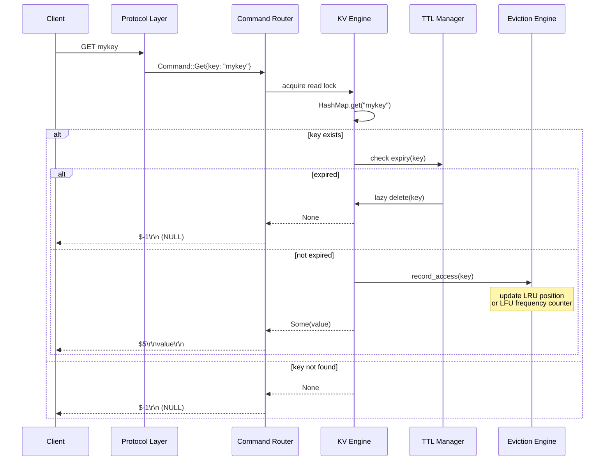
```mermaid
sequenceDiagram
    participant Client
    participant Protocol as Protocol Layer
    participant Router as Command Router
    participant Engine as KV Engine
    participant TTL as TTL Manager
    participant Eviction as Eviction Engine

    Client->>Protocol: GET mykey
    Protocol->>Router: Command::Get{key: "mykey"}

    Router->>Engine: acquire read lock
    Engine->>Engine: HashMap.get("mykey")

    alt key exists
        Engine->>TTL: check expiry(key)
        alt expired
            TTL->>Engine: lazy delete(key)
            Engine-->>Router: None
            Router-->>Client: $-1\r\n (NULL)
        else not expired
            Engine->>Eviction: record_access(key)
            Note over Eviction: update LRU position<br/>or LFU frequency counter
            Engine-->>Router: Some(value)
            Router-->>Client: $5\r\nvalue\r\n
        end
    else key not found
        Engine-->>Router: None
        Router-->>Client: $-1\r\n (NULL)
    end
```

### 3.4 分层职责说明

| 层级                    | 职责                                                                 |
| ----------------------- | -------------------------------------------------------------------- |
| **L1 Client Layer**     | 发起 TCP 请求，接收响应（支持 redis-cli / nc / SDK）                 |
| **L2 Network Layer**    | TCP 连接管理、连接数限制、超时控制、线程/任务调度                    |
| **L3 Protocol Layer**   | 协议检测与切换、命令解析（Simple/RESP）、响应格式化                  |
| **L4 Core Storage**     | 命令路由、KV 读写、TTL 管理、缓存淘汰、内存追踪                     |
| **L5 Persistence**      | AOF 写入、AOF 重放恢复、AOF 后台压缩                                |
| **L6 System Layer**     | 文件系统 IO、信号处理、系统时钟                                      |

### 3.5 组件依赖关系图

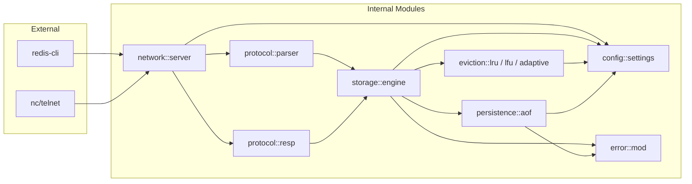
```mermaid
graph LR
    subgraph External["External"]
        CLI["redis-cli"]
        NC["nc/telnet"]
    end

    subgraph Modules["Internal Modules"]
        server["network::server"]
        parser["protocol::parser"]
        resp["protocol::resp"]
        engine["storage::engine"]
        eviction_mod["eviction::lru / lfu / adaptive"]
        aof["persistence::aof"]
        config["config::settings"]
        error["error::mod"]
    end

    CLI --> server
    NC --> server
    server --> parser
    server --> resp
    parser --> engine
    resp --> engine
    engine --> eviction_mod
    engine --> aof
    engine --> error
    aof --> error
    server --> config
    engine --> config
    eviction_mod --> config
    aof --> config
```

---

## 4. 模块结构

```text
src/
├── main.rs              # Entry point, server bootstrap
├── network/
│   ├── mod.rs
│   └── server.rs        # TCP listener, connection dispatch
├── protocol/
│   ├── mod.rs
│   ├── parser.rs        # Command parsing, response formatting
│   └── resp.rs          # RESP protocol codec (v0.2+)
├── storage/
│   ├── mod.rs
│   └── engine.rs        # KV engine (HashMap + Arc<RwLock>)
├── eviction/
│   ├── mod.rs
│   ├── lru.rs           # LRU eviction policy (v0.2+)
│   ├── lfu.rs           # LFU eviction policy (v0.2+)
│   └── adaptive.rs      # Adaptive Hybrid Eviction / AHE (v0.2+)
├── persistence/
│   ├── mod.rs
│   └── aof.rs           # AOF write & replay
├── config/
│   ├── mod.rs
│   └── settings.rs      # Configuration management
└── error/
    └── mod.rs            # Unified error types
```

---

## 5. 核心设计

### 5.1 存储结构

```rust
use std::collections::HashMap;
use std::sync::{Arc, RwLock};
use std::time::Instant;

/// Value entry with metadata for TTL and eviction tracking
pub struct ValueEntry {
    pub data: String,
    pub created_at: Instant,
    pub last_accessed: Instant,
    pub access_count: u64,
    pub expire_at: Option<Instant>,  // None = no expiry
}

type KvStore = Arc<RwLock<HashMap<String, ValueEntry>>>;
```

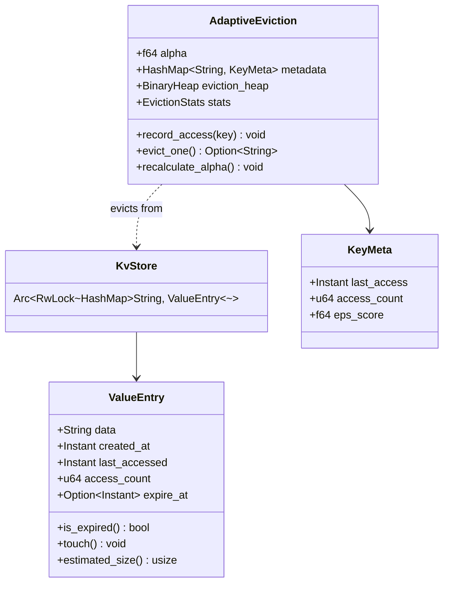
```mermaid
classDiagram
    class KvStore {
        Arc~RwLock~HashMap~String, ValueEntry~~~
    }
    class ValueEntry {
        +String data
        +Instant created_at
        +Instant last_accessed
        +u64 access_count
        +Option~Instant~ expire_at
        +is_expired() bool
        +touch() void
        +estimated_size() usize
    }
    class KeyMeta {
        +Instant last_access
        +u64 access_count
        +f64 eps_score
    }
    class AdaptiveEviction {
        +f64 alpha
        +HashMap~String, KeyMeta~ metadata
        +BinaryHeap eviction_heap
        +EvictionStats stats
        +record_access(key) void
        +evict_one() Option~String~
        +recalculate_alpha() void
    }
    KvStore --> ValueEntry
    AdaptiveEviction --> KeyMeta
    AdaptiveEviction ..> KvStore : evicts from
```

### 5.2 并发模型

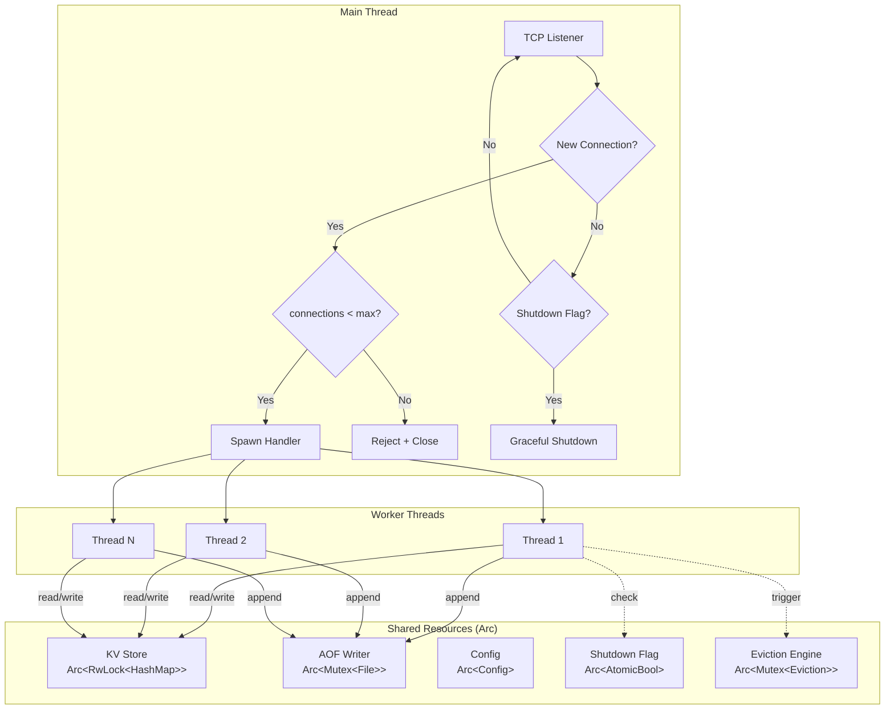
```mermaid
flowchart TB
    subgraph MainThread["Main Thread"]
        A["TCP Listener"] --> B{"New Connection?"}
        B -->|Yes| C{"connections < max?"}
        C -->|Yes| D["Spawn Handler"]
        C -->|No| E["Reject + Close"]
        B -->|No| F{"Shutdown Flag?"}
        F -->|No| A
        F -->|Yes| G["Graceful Shutdown"]
    end

    subgraph Workers["Worker Threads"]
        D --> W1["Thread 1"]
        D --> W2["Thread 2"]
        D --> W3["Thread N"]
    end

    subgraph SharedResources["Shared Resources (Arc)"]
        KV["KV Store<br/>Arc&lt;RwLock&lt;HashMap&gt;&gt;"]
        AOF_W["AOF Writer<br/>Arc&lt;Mutex&lt;File&gt;&gt;"]
        CFG["Config<br/>Arc&lt;Config&gt;"]
        SHUT["Shutdown Flag<br/>Arc&lt;AtomicBool&gt;"]
        EVICT["Eviction Engine<br/>Arc&lt;Mutex&lt;Eviction&gt;&gt;"]
    end

    W1 -->|"read/write"| KV
    W2 -->|"read/write"| KV
    W3 -->|"read/write"| KV
    W1 -->|"append"| AOF_W
    W2 -->|"append"| AOF_W
    W3 -->|"append"| AOF_W
    W1 -.->|"check"| SHUT
    W1 -.->|"trigger"| EVICT
```

- **one thread per connection** —— 每个客户端连接独立线程处理
- **Arc** —— 跨线程共享所有权
- **RwLock** —— 读写锁，允许多读单写
- **Mutex** —— 互斥锁，保护 AOF 文件和淘汰引擎
- **AtomicBool** —— 无锁 shutdown 信号

### 5.3 命令流转

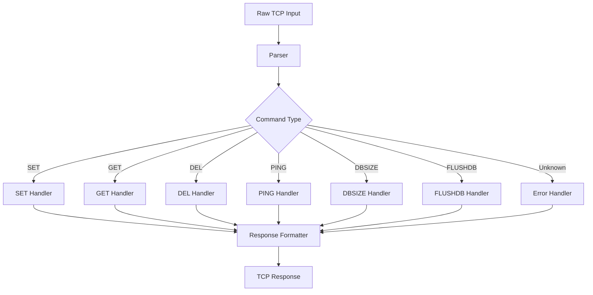
```mermaid
flowchart TB
    A[Raw TCP Input] --> B[Parser]
    B --> C{Command Type}
    C -->|SET| D[SET Handler]
    C -->|GET| E[GET Handler]
    C -->|DEL| F[DEL Handler]
    C -->|PING| G[PING Handler]
    C -->|DBSIZE| H[DBSIZE Handler]
    C -->|FLUSHDB| I[FLUSHDB Handler]
    C -->|Unknown| J[Error Handler]

    D --> K[Response Formatter]
    E --> K
    F --> K
    G --> K
    H --> K
    I --> K
    J --> K

    K --> L[TCP Response]
```

---

## 6. 协议规范

### 6.1 请求格式

- 每条命令以 `\n` 结尾（行协议）
- 命令与参数之间以空格分隔
- 大小写不敏感（内部统一转大写处理）

### 6.2 命令定义

| 命令             | 参数数量 | 返回值             | 说明               |
| ---------------- | -------- | ------------------ | ------------------ |
| `SET key value`  | 2        | `OK`               | 设置键值对         |
| `GET key`        | 1        | `<value>` / `NULL` | 获取值             |
| `DEL key`        | 1        | `OK` / `NULL`      | 删除键             |
| `PING`           | 0        | `PONG`             | 健康检查           |
| `DBSIZE`         | 0        | `<count>`          | 返回当前键数量     |
| `FLUSHDB`        | 0        | `OK`               | 清空所有数据       |
| `EXPIRE key secs`| 2        | `OK` / `NULL`      | 设置键过期时间（秒）|
| `TTL key`        | 1        | `<seconds>` / `-1` / `-2` | 查询剩余存活时间 |

### 6.3 错误响应格式

```text
ERR unknown command: <cmd>
ERR wrong number of arguments for '<cmd>' command
ERR internal error
```

### 6.4 Key/Value 约束

| 约束项     | 限制                     |
| ---------- | ------------------------ |
| Key 长度   | 1 ~ 512 bytes            |
| Value 长度 | 1 ~ 1MB                  |
| 字符集     | UTF-8，不含换行符        |

---

## 7. 错误处理设计

### 7.1 错误类型枚举

```rust
pub enum FerrumError {
    /// Network IO errors
    IoError(std::io::Error),
    /// Command parsing errors (malformed input)
    ParseError(String),
    /// Storage operation errors
    StorageError(String),
    /// AOF persistence errors
    PersistenceError(String),
}
```

### 7.2 错误传播策略

| 层级             | 策略                                           |
| ---------------- | ---------------------------------------------- |
| Network Layer    | 捕获 IO 错误，记录日志，断开连接               |
| Protocol Layer   | 返回 `ERR <message>` 给客户端                  |
| Storage Layer    | 向上传播，由 Protocol Layer 格式化响应          |
| Persistence      | 记录日志，不阻塞主流程（best-effort 写入）     |

### 7.3 错误处理流程

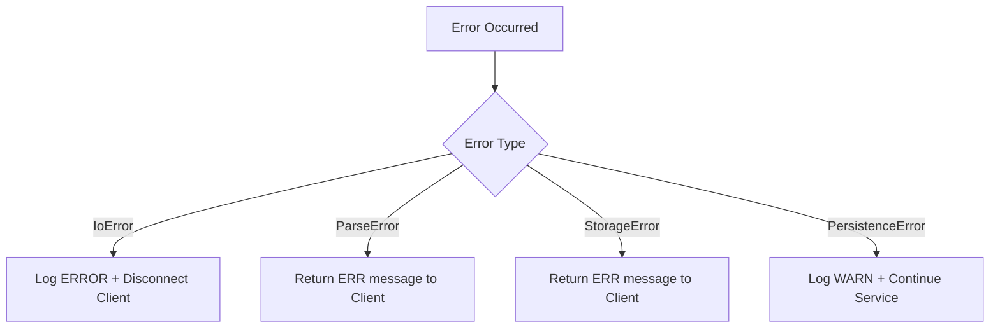
```mermaid
flowchart TB
    A[Error Occurred] --> B{Error Type}
    B -->|IoError| C[Log ERROR + Disconnect Client]
    B -->|ParseError| D["Return ERR message to Client"]
    B -->|StorageError| E["Return ERR message to Client"]
    B -->|PersistenceError| F[Log WARN + Continue Service]
```

---

## 8. 持久化设计（AOF）

### 8.1 写入流程

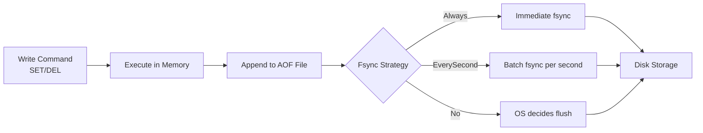
```mermaid
flowchart LR
    A[Write Command<br/>SET/DEL] --> B[Execute in Memory]
    B --> C[Append to AOF File]
    C --> D{Fsync Strategy}
    D -->|Always| E[Immediate fsync]
    D -->|EverySecond| F[Batch fsync per second]
    D -->|No| G[OS decides flush]
    E --> H[Disk Storage]
    F --> H
    G --> H
```

### 8.2 恢复流程

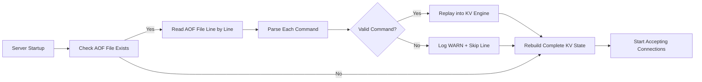
```mermaid
flowchart LR
    A[Server Startup] --> B[Check AOF File Exists]
    B -->|Yes| C[Read AOF File Line by Line]
    C --> D[Parse Each Command]
    D --> E{Valid Command?}
    E -->|Yes| F[Replay into KV Engine]
    E -->|No| G[Log WARN + Skip Line]
    F --> H[Rebuild Complete KV State]
    G --> H
    B -->|No| H
    H --> I[Start Accepting Connections]
```

### 8.3 日志格式

每条写命令追加为一行文本：

```text
SET key1 value1
DEL key2
SET key3 value3
```

### 8.4 写入策略

| 策略          | 说明                       | 数据安全性 | 性能 |
| ------------- | -------------------------- | ---------- | ---- |
| Always        | 每条命令后 fsync           | ⭐⭐⭐     | ⭐   |
| EverySecond   | 每秒批量 fsync（**默认**） | ⭐⭐       | ⭐⭐ |
| No            | 由 OS 决定刷盘时机         | ⭐         | ⭐⭐⭐ |

### 8.5 AOF Compaction（未来扩展）

当 AOF 文件超过阈值时，通过重写压缩：

1. 遍历当前内存状态
2. 生成最小化的命令序列
3. 原子替换旧 AOF 文件

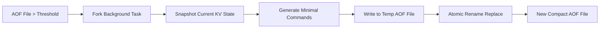
```mermaid
flowchart LR
    A[AOF File > Threshold] --> B[Fork Background Task]
    B --> C[Snapshot Current KV State]
    C --> D[Generate Minimal Commands]
    D --> E[Write to Temp AOF File]
    E --> F[Atomic Rename Replace]
    F --> G[New Compact AOF File]
```

### 8.6 并发写入安全

- AOF Writer 持有独立的 `Mutex<File>`
- 写命令在获取 KV 写锁后，同步追加 AOF
- 保证命令顺序与内存状态一致

---

## 9. 内存管理与缓存淘汰设计

### 9.1 设计目标

当内存使用超过 `maxmemory` 限制时，自动淘汰低优先级的键，防止 OOM 崩溃。

### 9.2 淘汰触发流程

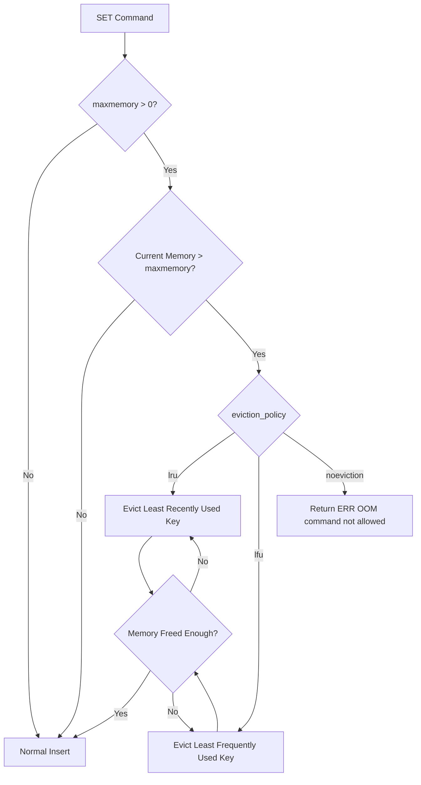
```mermaid
flowchart TB
    A[SET Command] --> B{maxmemory > 0?}
    B -->|No| C[Normal Insert]
    B -->|Yes| D{Current Memory > maxmemory?}
    D -->|No| C
    D -->|Yes| E{eviction_policy}
    E -->|lru| F[Evict Least Recently Used Key]
    E -->|lfu| G[Evict Least Frequently Used Key]
    E -->|noeviction| H["Return ERR OOM command not allowed"]
    F --> I{Memory Freed Enough?}
    G --> I
    I -->|Yes| C
    I -->|No| F
    I -->|No| G
```

### 9.3 淘汰策略

| 策略          | 算法                                   | 适用场景                     |
| ------------- | -------------------------------------- | ---------------------------- |
| `lru`         | 淘汰最近最少访问的键                   | 热点数据访问模式             |
| `lfu`         | 淘汰访问频率最低的键                   | 频率差异明显的访问模式       |
| `adaptive`    | AHE 自适应混合淘汰（EPS 评分）         | 访问模式多变的混合场景       |
| `noeviction`  | 不淘汰，写入命令返回 OOM 错误         | 数据不可丢失场景（**默认**） |

### 9.4 LRU 实现方案

基于 `HashMap + 双向链表` 的经典 O(1) LRU：

```rust
pub struct LruCache {
    capacity: usize,
    map: HashMap<String, *mut LruNode>,
    head: *mut LruNode,  // Most recently used
    tail: *mut LruNode,  // Least recently used
}

struct LruNode {
    key: String,
    prev: *mut LruNode,
    next: *mut LruNode,
}
```

- **GET / SET** 时将节点移到链表头部
- **淘汰** 时从链表尾部移除
- 时间复杂度：O(1) 查找、O(1) 淘汰

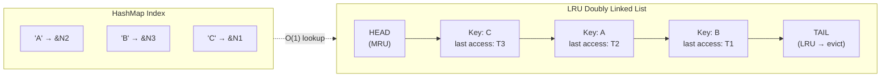
```mermaid
graph LR
    subgraph LRU["LRU Doubly Linked List"]
        direction LR
        HEAD["HEAD<br/>(MRU)"] --> N1["Key: C<br/>last access: T3"]
        N1 --> N2["Key: A<br/>last access: T2"]
        N2 --> N3["Key: B<br/>last access: T1"]
        N3 --> TAIL["TAIL<br/>(LRU → evict)"]
    end

    subgraph HashMap["HashMap Index"]
        H1["'A' → &N2"]
        H2["'B' → &N3"]
        H3["'C' → &N1"]
    end

    HashMap -.->|"O(1) lookup"| LRU
```

### 9.5 LFU 实现方案

基于频率桶的 O(1) LFU：

```rust
pub struct LfuCache {
    min_freq: usize,
    map: HashMap<String, (usize, usize)>,  // key -> (value_index, frequency)
    freq_map: HashMap<usize, LinkedHashSet<String>>,  // frequency -> keys
}
```

- **GET / SET** 时增加访问频率计数
- **淘汰** 时从最低频率桶中移除最早的键
- 时间复杂度：O(1) 查找、O(1) 淘汰

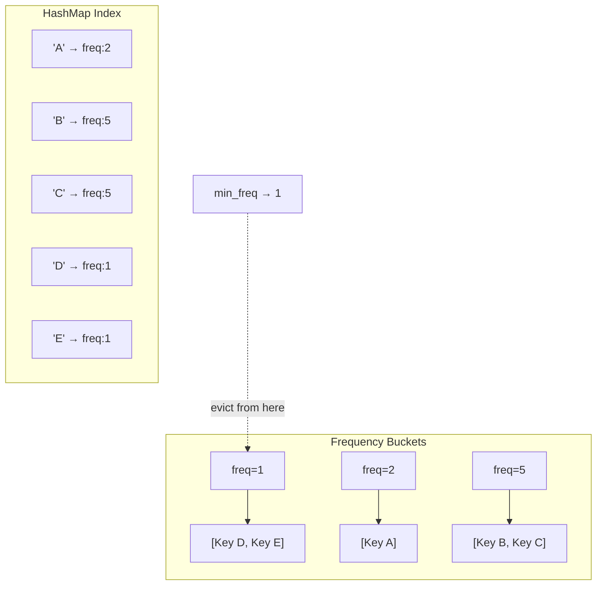
```mermaid
graph TB
    subgraph FreqBuckets["Frequency Buckets"]
        F1["freq=1"] --> B1["[Key D, Key E]"]
        F2["freq=2"] --> B2["[Key A]"]
        F3["freq=5"] --> B3["[Key B, Key C]"]
    end

    MIN["min_freq → 1"] -.->|"evict from here"| F1

    subgraph HashMap["HashMap Index"]
        HA["'A' → freq:2"]
        HB["'B' → freq:5"]
        HC["'C' → freq:5"]
        HD["'D' → freq:1"]
        HE["'E' → freq:1"]
    end
```

### 9.6 🚀 创新算法：Adaptive Hybrid Eviction（AHE）

> **FerrumKV 原创设计** —— 自适应混合淘汰算法，结合 LRU 的时间局部性与 LFU 的频率优势，根据实时负载特征动态调整淘汰权重。

#### 9.6.1 设计动机

| 场景 | LRU 表现 | LFU 表现 | 问题 |
| ---- | -------- | -------- | ---- |
| 突发热点（如秒杀） | ✅ 好 | ❌ 新热点频率低被误淘汰 | LFU 冷启动问题 |
| 稳定高频访问 | ❌ 偶尔未访问就被淘汰 | ✅ 好 | LRU 无法识别长期价值 |
| 扫描污染（全表遍历） | ❌ 大量冷数据涌入驱逐热数据 | ✅ 好 | LRU 抗扫描能力差 |
| 访问模式切换 | 固定策略无法适应 | 固定策略无法适应 | 需要自适应 |

**核心思想**：为每个键计算一个综合 **淘汰优先级分数（Eviction Priority Score, EPS）**，融合时间衰减与频率信息，分数最低的键优先被淘汰。

#### 9.6.2 EPS 评分公式

```
EPS(key) = α × recency_score(key) + (1 - α) × frequency_score(key)
```

其中：

- **`recency_score`** = `1.0 / (1.0 + elapsed_seconds_since_last_access)`
  - 最近访问的键分数趋近 1.0，长时间未访问趋近 0
- **`frequency_score`** = `log2(1 + access_count) / log2(1 + max_access_count)`
  - 对数归一化，防止高频键垄断，压缩频率差距
- **`α`（alpha）** = 自适应权重，范围 `[0.0, 1.0]`
  - `α → 1.0`：偏向 LRU（时间局部性主导）
  - `α → 0.0`：偏向 LFU（频率主导）

#### 9.6.3 自适应权重调整

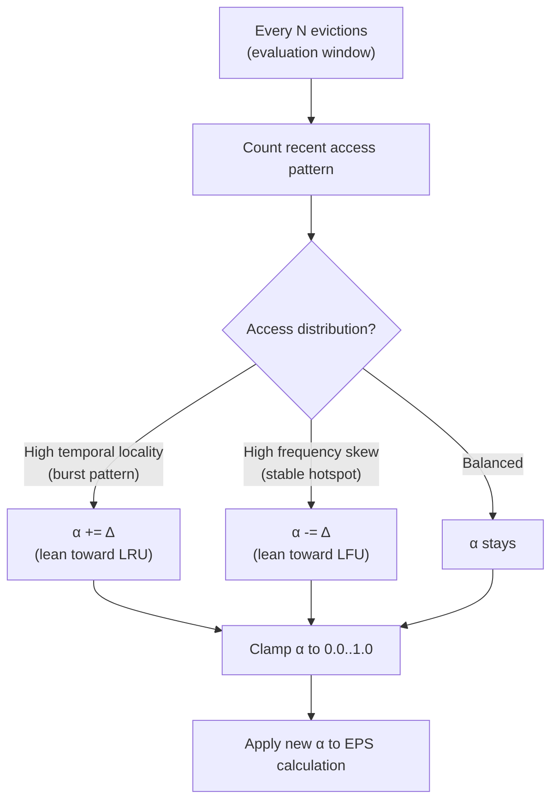
```mermaid
flowchart TB
    A["Every N evictions<br/>(evaluation window)"] --> B["Count recent access pattern"]
    B --> C{"Access distribution?"}
    C -->|"High temporal locality<br/>(burst pattern)"| D["α += Δ<br/>(lean toward LRU)"]
    C -->|"High frequency skew<br/>(stable hotspot)"| E["α -= Δ<br/>(lean toward LFU)"]
    C -->|"Balanced"| F["α stays"]
    D --> G["Clamp α to 0.0..1.0"]
    E --> G
    F --> G
    G --> H["Apply new α to EPS calculation"]
```

**自适应指标**：

- **时间局部性指标** = 最近 1 秒内被访问的键占总键数的比例
- **频率偏斜指标** = Top 10% 高频键的访问量占总访问量的比例
- 当时间局部性高（突发流量）→ 增大 α
- 当频率偏斜高（稳定热点）→ 减小 α

#### 9.6.4 数据结构设计

```rust
/// Adaptive Hybrid Eviction engine
pub struct AdaptiveEviction {
    /// Adaptive weight: 0.0 (pure LFU) ~ 1.0 (pure LRU)
    alpha: f64,
    /// Per-key metadata
    metadata: HashMap<String, KeyMeta>,
    /// Min-heap ordered by EPS score (lowest = evict first)
    eviction_heap: BinaryHeap<Reverse<(OrderedFloat<f64>, String)>>,
    /// Global stats for adaptive tuning
    stats: EvictionStats,
}

struct KeyMeta {
    /// Last access timestamp (Instant)
    last_access: Instant,
    /// Total access count
    access_count: u64,
    /// Cached EPS score (recomputed periodically)
    eps_score: f64,
}

struct EvictionStats {
    /// Total accesses in current evaluation window
    window_total_accesses: u64,
    /// Accesses in last 1 second
    recent_accesses: u64,
    /// Access count of top 10% keys
    top_decile_accesses: u64,
    /// Evaluation window counter
    eviction_count: u64,
}
```

#### 9.6.5 算法流程图

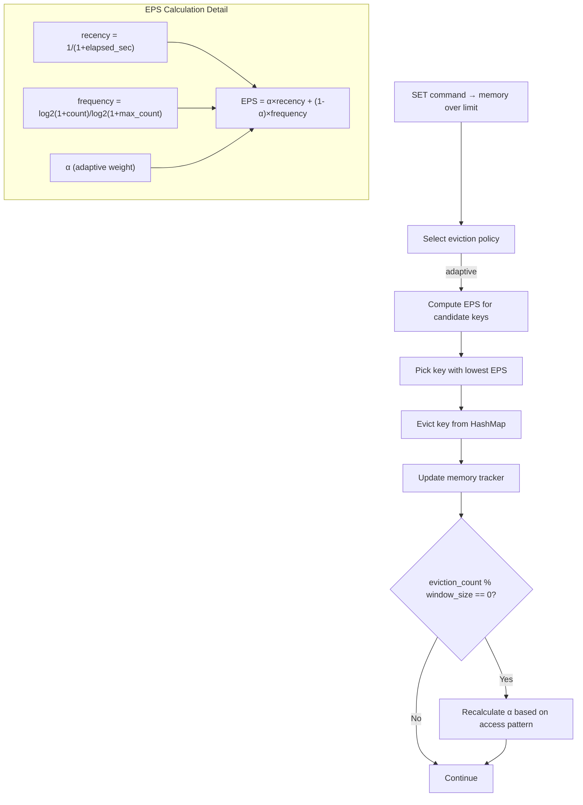
```mermaid
flowchart TB
    A["SET command → memory over limit"] --> B["Select eviction policy"]
    B -->|adaptive| C["Compute EPS for candidate keys"]
    C --> D["Pick key with lowest EPS"]
    D --> E["Evict key from HashMap"]
    E --> F["Update memory tracker"]
    F --> G{"eviction_count % window_size == 0?"}
    G -->|Yes| H["Recalculate α based on access pattern"]
    G -->|No| I["Continue"]
    H --> I

    subgraph EPS_Calc["EPS Calculation Detail"]
        direction LR
        R["recency = 1/(1+elapsed_sec)"] --> EPS
        FQ["frequency = log2(1+count)/log2(1+max_count)"] --> EPS
        AL["α (adaptive weight)"] --> EPS
        EPS["EPS = α×recency + (1-α)×frequency"]
    end
```

#### 9.6.6 与经典算法对比

| 维度 | LRU | LFU | **AHE（FerrumKV）** |
| ---- | --- | --- | -------------------- |
| 时间复杂度 | O(1) | O(1) | O(log N) 淘汰 / O(1) 访问记录 |
| 空间开销 | 低 | 中 | 中（额外 metadata + heap） |
| 突发热点适应 | ✅ | ❌ | ✅ 自适应 α 偏向 LRU |
| 稳定热点保护 | ❌ | ✅ | ✅ 自适应 α 偏向 LFU |
| 扫描污染抵抗 | ❌ | ✅ | ✅ 频率分数兜底 |
| 模式切换适应 | ❌ | ❌ | ✅ 动态调整权重 |
| 实现复杂度 | 低 | 中 | 中高 |
| 可调参数 | 无 | 无 | α 初始值、Δ 步长、窗口大小 |

#### 9.6.7 配置项

| 配置项 | 默认值 | 说明 |
| ------ | ------ | ---- |
| `eviction_policy` | `noeviction` | 设为 `adaptive` 启用 AHE |
| `ahe_alpha_init` | `0.5` | α 初始值（0.5 = LRU/LFU 均衡） |
| `ahe_alpha_delta` | `0.05` | 每次调整的步长 |
| `ahe_window_size` | `100` | 每 N 次淘汰后重新评估 α |

### 9.7 淘汰策略总览

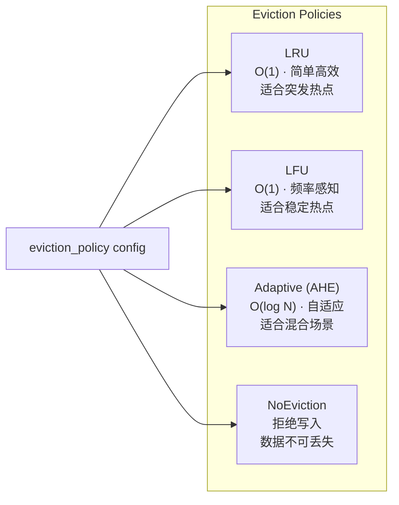
```mermaid
flowchart LR
    subgraph Policies["Eviction Policies"]
        direction TB
        LRU["LRU<br/>O(1) · 简单高效<br/>适合突发热点"]
        LFU["LFU<br/>O(1) · 频率感知<br/>适合稳定热点"]
        AHE["Adaptive (AHE)<br/>O(log N) · 自适应<br/>适合混合场景"]
        NO["NoEviction<br/>拒绝写入<br/>数据不可丢失"]
    end

    CONFIG["eviction_policy config"] --> LRU
    CONFIG --> LFU
    CONFIG --> AHE
    CONFIG --> NO
```

### 9.8 内存统计

| 指标                  | 说明                                |
| --------------------- | ----------------------------------- |
| `used_memory`         | 当前 KV 数据占用的估算内存          |
| `maxmemory`           | 配置的内存上限                      |
| `evicted_keys`        | 累计淘汰的键数量                    |
| `eviction_policy`     | 当前使用的淘汰策略                  |
| `ahe_alpha`           | 当前 AHE 自适应权重值（仅 adaptive 模式） |
| `ahe_recency_ratio`   | 时间局部性指标                      |
| `ahe_frequency_skew`  | 频率偏斜指标                        |

---

## 10. RESP 协议兼容设计

### 10.1 设计目标

支持 RESP（Redis Serialization Protocol）子集，使 FerrumKV 可以直接使用 `redis-cli` 和 `redis-benchmark` 进行交互和测试。

> **注意**：不追求 Redis 全协议兼容（200+ 命令），仅支持 FerrumKV 已实现的命令集。

### 10.2 协议模式切换

通过 `protocol_mode` 配置项切换：

| 模式     | 说明                                     | 客户端工具           |
| -------- | ---------------------------------------- | -------------------- |
| `simple` | 行协议（`\n` 分隔），**默认**            | `nc` / `telnet`      |
| `resp`   | RESP 二进制安全协议                      | `redis-cli` / SDK    |

### 10.3 RESP 数据类型（支持子集）

| 类型          | 前缀 | 示例                              | 说明             |
| ------------- | ---- | --------------------------------- | ---------------- |
| Simple String | `+`  | `+OK\r\n`                        | 简单字符串响应   |
| Error         | `-`  | `-ERR unknown command\r\n`       | 错误响应         |
| Integer       | `:`  | `:1024\r\n`                      | 整数响应         |
| Bulk String   | `$`  | `$5\r\nvalue\r\n`               | 二进制安全字符串 |
| Array         | `*`  | `*3\r\n$3\r\nSET\r\n$3\r\nkey\r\n$5\r\nvalue\r\n` | 数组（请求格式） |
| Null          | `$`  | `$-1\r\n`                        | 空值             |

### 10.4 请求解析流程

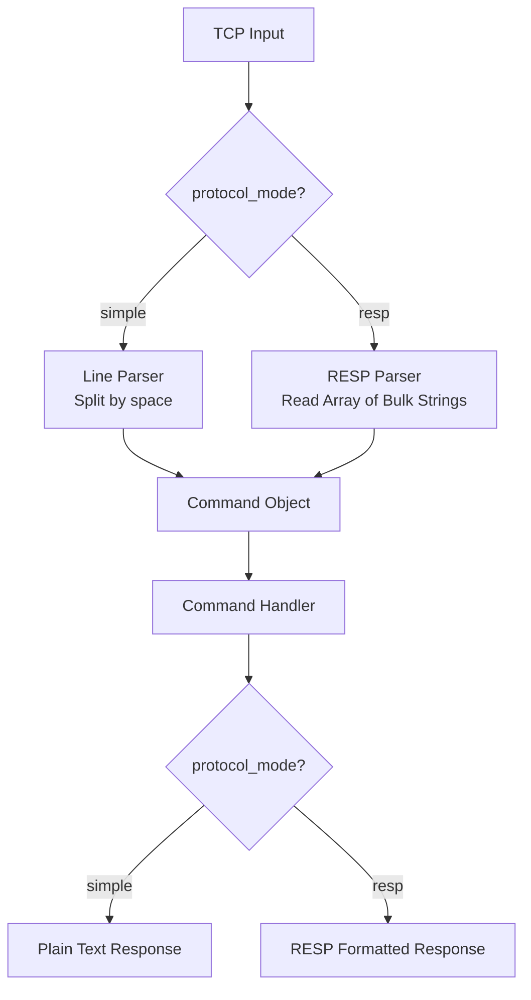
```mermaid
flowchart TB
    A[TCP Input] --> B{protocol_mode?}
    B -->|simple| C[Line Parser<br/>Split by space]
    B -->|resp| D[RESP Parser<br/>Read Array of Bulk Strings]
    C --> E[Command Object]
    D --> E
    E --> F[Command Handler]
    F --> G{protocol_mode?}
    G -->|simple| H[Plain Text Response]
    G -->|resp| I[RESP Formatted Response]
```

### 10.5 RESP 编解码示例

**请求**（redis-cli 发送 `SET name ferrum`）：

```text
*3\r\n
$3\r\n
SET\r\n
$4\r\n
name\r\n
$6\r\n
ferrum\r\n
```

**响应**：

```text
+OK\r\n
```

### 10.6 redis-cli 兼容验证

```bash
# Start FerrumKV with RESP mode
./ferrum-kv --protocol-mode resp

# Connect with redis-cli
redis-cli -p 6380
127.0.0.1:6380> SET name ferrum
OK
127.0.0.1:6380> GET name
"ferrum"
127.0.0.1:6380> DEL name
(integer) 1
127.0.0.1:6380> DBSIZE
(integer) 0
```

---

## 11. 异步运行时演进设计

### 11.1 设计目标

将网络层从 `std::thread` 同步模型迁移到 `Tokio` 异步模型，提升高并发场景下的性能和资源利用率。

> **策略**：先用同步模型完成核心功能（Phase 1~5），再在 Phase 8 引入 Tokio 做异步重构。对比学习效果最佳。

### 11.2 同步 vs 异步对比

| 维度         | 同步模型（std::thread）           | 异步模型（Tokio）                  |
| ------------ | --------------------------------- | ---------------------------------- |
| 并发模型     | one thread per connection         | M:N 协程调度                       |
| 内存开销     | ~8MB/线程（栈空间）               | ~几KB/任务                         |
| 128 连接     | ~1GB 内存                         | ~几MB 内存                         |
| 10K 连接     | ❌ 不可行                         | ✅ 轻松支持                        |
| 上下文切换   | OS 线程切换（重量级）             | 用户态任务切换（轻量级）           |
| 学习曲线     | 低                                | 中高（async/await, Pin, Future）   |
| 适用阶段     | Phase 1~5（学习基础并发）         | Phase 8（进阶异步编程）            |

### 11.3 异步架构图

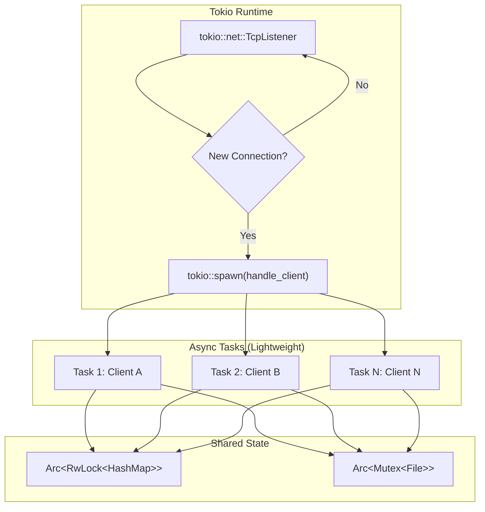
```mermaid
flowchart TB
    subgraph TokioRuntime["Tokio Runtime"]
        A["tokio::net::TcpListener"] --> B{New Connection?}
        B -->|Yes| C["tokio::spawn(handle_client)"]
        B -->|No| A
    end

    subgraph AsyncTasks["Async Tasks (Lightweight)"]
        C --> T1["Task 1: Client A"]
        C --> T2["Task 2: Client B"]
        C --> T3["Task N: Client N"]
    end

    subgraph SharedState["Shared State"]
        KV["Arc&lt;RwLock&lt;HashMap&gt;&gt;"]
        AOF["Arc&lt;Mutex&lt;File&gt;&gt;"]
    end

    T1 --> KV
    T2 --> KV
    T3 --> KV
    T1 --> AOF
    T2 --> AOF
    T3 --> AOF
```

### 11.4 重构路径


```mermaid
flowchart LR
    A["Step 1<br/>添加 Tokio 依赖"] --> B["Step 2<br/>main() → #[tokio::main]"]
    B --> C["Step 3<br/>TcpListener → tokio::net"]
    C --> D["Step 4<br/>thread::spawn → tokio::spawn"]
    D --> E["Step 5<br/>BufReader → tokio::io"]
    E --> F["Step 6<br/>AOF 异步写入"]
    F --> G["Step 7<br/>Benchmark 对比"]
```

### 11.5 关键代码变更预览

**Before（同步）：**

```rust
// std::thread model
fn main() {
    let listener = TcpListener::bind(addr)?;
    for stream in listener.incoming() {
        thread::spawn(|| handle_client(stream));
    }
}
```

**After（异步）：**

```rust
// Tokio async model
#[tokio::main]
async fn main() {
    let listener = TcpListener::bind(addr).await?;
    loop {
        let (stream, _) = listener.accept().await?;
        tokio::spawn(async move {
            handle_client(stream).await;
        });
    }
}
```

### 11.6 依赖变更

| Crate   | 版本   | 用途                          |
| ------- | ------ | ----------------------------- |
| `tokio` | 1.x    | 异步运行时（rt-multi-thread） |

```toml
[dependencies]
tokio = { version = "1", features = ["full"] }
```

---

## 12. 配置管理

### 12.1 配置项

| 配置项            | 默认值           | 说明                                    |
| ----------------- | ---------------- | --------------------------------------- |
| `bind`            | `127.0.0.1`      | 监听地址                                |
| `port`            | `6380`           | 监听端口                                |
| `aof_enabled`     | `true`           | 是否开启 AOF                            |
| `aof_filepath`    | `./ferrum.aof`   | AOF 文件路径                            |
| `aof_fsync`       | `everysec`       | AOF 刷盘策略                            |
| `max_connections` | `128`            | 最大并发连接数                          |
| `log_level`       | `info`           | 日志级别                                |
| `conn_timeout`    | `300`            | 连接超时时间（秒）                      |
| `maxmemory`       | `0`              | 最大内存限制（0 = 无限制，单位 bytes）  |
| `eviction_policy` | `noeviction`     | 淘汰策略：`lru` / `lfu` / `adaptive` / `noeviction` |
| `ahe_alpha_init`  | `0.5`            | AHE 自适应权重初始值（仅 adaptive 模式） |
| `ahe_alpha_delta` | `0.05`           | AHE 权重调整步长                        |
| `ahe_window_size` | `100`            | AHE 评估窗口大小（淘汰次数）            |
| `protocol_mode`   | `simple`         | 协议模式：`simple`（行协议）/ `resp`    |

### 12.2 加载优先级

```mermaid
flowchart LR
    A["命令行参数<br/>(最高优先级)"] --> D[Final Config]
    B["配置文件<br/>ferrum.conf"] --> D
    C["默认值<br/>(最低优先级)"] --> D
```

1. **命令行参数**（最高优先级）
2. **配置文件** `ferrum.conf`
3. **默认值**（最低优先级）

---

## 13. 并发模型

### 13.1 线程模型

```mermaid
flowchart TB
    subgraph MainThread["Main Thread"]
        A[TCP Listener] --> B{New Connection?}
        B -->|Yes| C[Spawn Handler Thread]
        B -->|No| A
    end

    subgraph WorkerThreads["Worker Threads"]
        C --> T1[Thread 1: Client A]
        C --> T2[Thread 2: Client B]
        C --> T3[Thread 3: Client C]
    end

    subgraph SharedState["Shared State"]
        KV["Arc&lt;RwLock&lt;HashMap&gt;&gt;"]
        AOF["Arc&lt;Mutex&lt;File&gt;&gt;"]
    end

    T1 --> KV
    T2 --> KV
    T3 --> KV
    T1 --> AOF
    T2 --> AOF
    T3 --> AOF
```

### 13.2 锁策略

| 操作     | 锁类型     | 说明                           |
| -------- | ---------- | ------------------------------ |
| GET      | Read Lock  | 允许多个 GET 并发执行          |
| SET      | Write Lock | 独占写入，阻塞其他读写        |
| DEL      | Write Lock | 独占写入，阻塞其他读写        |
| DBSIZE   | Read Lock  | 读取 HashMap 长度              |
| FLUSHDB  | Write Lock | 清空所有数据                   |
| AOF 写入 | Mutex Lock | 独立于 KV 锁，保证文件写入顺序 |

---

## 14. 一致性模型

| 类型     | 支持     | 说明                                     |
| -------- | -------- | ---------------------------------------- |
| 强一致   | ❌       | 单机无副本，不涉及分布式一致性           |
| 最终一致 | ✅       | 单机内存操作，写入即可见                 |
| 崩溃恢复 | ⚠️ AOF  | 取决于 fsync 策略，可能丢失最后几条命令  |

---

## 15. 优雅关闭设计

### 15.1 信号处理流程

```mermaid
flowchart LR
    A["SIGINT / SIGTERM"] --> B["Set Shutdown Flag<br/>(AtomicBool)"]
    B --> C[Stop Accepting<br/>New Connections]
    C --> D[Wait Active<br/>Connections Drain]
    D --> E[Flush AOF to Disk]
    E --> F[Exit Process]
```

### 15.2 实现要点

- 使用 `Arc<AtomicBool>` 作为全局 shutdown flag
- Main loop 检查 flag 决定是否继续 accept
- 设置连接读写超时，避免僵尸连接阻塞关闭
- 关闭前强制 fsync AOF 文件，确保数据落盘

---

## 16. 日志与可观测性

### 16.1 日志级别

| 级别    | 用途                                          | 示例                                    |
| ------- | --------------------------------------------- | --------------------------------------- |
| `ERROR` | 不可恢复错误                                  | IO 失败、锁中毒（PoisonError）          |
| `WARN`  | 可恢复异常                                    | 客户端断连、命令格式错误、AOF 行损坏    |
| `INFO`  | 关键事件                                      | 启动、关闭、AOF 恢复完成、配置加载      |
| `DEBUG` | 调试信息                                      | 命令收发详情、锁获取耗时                |

### 16.2 日志格式

```text
[2026-03-26 12:00:00] [INFO]  FerrumKV listening on 127.0.0.1:6380
[2026-03-26 12:00:01] [INFO]  AOF loaded: 1024 commands replayed in 120ms
[2026-03-26 12:00:02] [INFO]  Client connected: 127.0.0.1:54321
[2026-03-26 12:00:02] [DEBUG] recv: SET name ferrum
[2026-03-26 12:00:02] [DEBUG] resp: OK
[2026-03-26 12:00:05] [WARN]  Parse error from 127.0.0.1:54321: empty command
[2026-03-26 12:01:00] [ERROR] AOF write failed: No space left on device
```

### 16.3 依赖

| Crate        | 用途             |
| ------------ | ---------------- |
| `log`        | 日志门面（Facade）|
| `env_logger` | 开发环境日志输出 |

---

## 17. 安全性考量

| 风险                   | 缓解措施                                        |
| ---------------------- | ----------------------------------------------- |
| 大 Value 导致 OOM      | Value 长度上限 1MB + maxmemory 限制 + LRU/LFU 淘汰 |
| 内存无限增长           | `maxmemory` 配置 + `eviction_policy` 自动淘汰   |
| 慢客户端占用线程       | 连接读写超时（默认 300s）                       |
| 恶意大量连接           | `max_connections` 限制（默认 128）              |
| AOF 文件损坏           | 启动时逐行校验，跳过损坏行并记录 WARN 日志     |
| 锁中毒（PoisonError）  | 捕获并返回内部错误，不 panic                    |
| 命令注入               | 严格解析协议，拒绝非法格式                      |

---

## 18. 性能目标与基准

### 18.1 性能指标

| 指标                      | 目标值             |
| ------------------------- | ------------------ |
| 单连接 SET QPS            | > 50,000 ops/sec   |
| 单连接 GET QPS            | > 80,000 ops/sec   |
| 并发连接数                | > 100              |
| 启动恢复速度（1M 条命令） | < 3s               |
| 内存占用（1M KV 对）      | < 200MB            |

### 18.2 基准测试方案

```bash
# Concurrent SET benchmark
for i in $(seq 1 10000); do
  echo "SET bench_key_$i bench_value_$i" | nc -q 0 127.0.0.1 6380 &
done
wait

# Concurrent GET benchmark
for i in $(seq 1 10000); do
  echo "GET bench_key_$i" | nc -q 0 127.0.0.1 6380 &
done
wait
```

---

## 19. 测试设计

### 19.1 单元测试

| 模块       | 测试内容                                     |
| ---------- | -------------------------------------------- |
| Parser     | 合法命令解析、非法命令拒绝、边界参数         |
| Engine     | SET/GET/DEL 正确性、DBSIZE、FLUSHDB          |
| AOF        | 写入格式、重放正确性、损坏行跳过             |
| Config     | 默认值、配置文件加载、命令行覆盖             |
| Eviction   | LRU 淘汰顺序、LFU 频率统计、AHE 自适应权重、maxmemory 触发  |
| RESP       | 编解码正确性、redis-cli 兼容性               |
| TTL        | 过期设置、过期删除、TTL 查询、持久化恢复     |

### 19.2 集成测试

#### 并发测试

```bash
# 100 concurrent clients
for i in {1..100}; do
  echo "SET k$i v$i" | nc 127.0.0.1 6380 &
done
wait

# Verify all keys
for i in {1..100}; do
  echo "GET k$i" | nc 127.0.0.1 6380
done
```

#### 重启恢复测试

```text
1. SET a 1
2. SET b 2
3. RESTART server
4. GET a => 1
5. GET b => 2
```

### 19.3 异常测试

| 测试场景         | 输入              | 期望输出                                       |
| ---------------- | ----------------- | ---------------------------------------------- |
| 参数不足         | `SET a`           | `ERR wrong number of arguments for 'SET' command` |
| 未知命令         | `INVALID_CMD`     | `ERR unknown command: INVALID_CMD`             |
| 空输入           | ` `               | `ERR empty command`                            |
| 超长 Key         | `SET <512+B> val` | `ERR key too long`                             |

---

## 20. 里程碑

### Phase 1: 核心骨架 🔨

- [x] TCP Server 监听
- [x] 多线程连接处理
- [ ] 命令解析器（Parser）
- [ ] KV Engine（HashMap + Arc\<RwLock\>）
- [ ] SET / GET / DEL 命令实现

### Phase 2: 功能完整 🧩

- [ ] PING / DBSIZE / FLUSHDB 命令
- [ ] 错误处理统一（FerrumError）
- [ ] 响应格式化（Response Formatter）

### Phase 3: 持久化 💾

- [ ] AOF 写入
- [ ] AOF 重放恢复
- [ ] 写入策略可配置（Always / EverySecond / No）

### Phase 4: 健壮性 🛡️

- [ ] 优雅关闭（信号处理）
- [ ] 连接超时管理
- [ ] 日志系统集成（log + env_logger）
- [ ] 配置管理（命令行 + 配置文件）

### Phase 5: 质量保障 ✅

- [ ] 单元测试（Engine / Parser / AOF）
- [ ] 集成测试（端到端）
- [ ] 并发压力测试
- [ ] 性能基准测试

### Phase 6: 内存管理与键过期 🧠

- [ ] TTL / EXPIRE 命令实现
- [ ] 惰性过期（访问时检查）+ 定期过期（后台扫描）
- [ ] `maxmemory` 配置支持
- [ ] LRU 淘汰策略实现
- [ ] LFU 淘汰策略实现
- [ ] AHE 自适应混合淘汰算法实现
- [ ] `eviction_policy` 配置支持（lru / lfu / adaptive / noeviction）

### Phase 7: RESP 协议兼容 📡

- [ ] RESP 协议编解码器（resp.rs）
- [ ] 支持 5 种 RESP 数据类型（Simple String / Error / Integer / Bulk String / Array）
- [ ] `protocol_mode` 配置切换（simple / resp）
- [ ] redis-cli 连接验证
- [ ] redis-benchmark 性能测试

### Phase 8: 异步运行时 ⚡

- [ ] 引入 Tokio 依赖
- [ ] 网络层异步重构（`tokio::net::TcpListener`）
- [ ] 连接处理改为 `tokio::spawn` 异步任务
- [ ] AOF 异步写入（`tokio::fs`）
- [ ] 同步 vs 异步性能对比 Benchmark

```mermaid
gantt
    title FerrumKV Development Plan
    dateFormat  YYYY-MM-DD

    section Phase 1: Core
    TCP Server           :done, a1, 2026-01-01, 1d
    Thread Model         :done, a2, after a1, 1d
    Command Parser       :a3, after a2, 1d
    KV Engine            :a4, after a3, 1d
    SET/GET/DEL          :a5, after a4, 1d

    section Phase 2: Features
    PING/DBSIZE/FLUSHDB  :b1, after a5, 1d
    Error Handling       :b2, after b1, 1d
    Response Formatter   :b3, after b2, 1d

    section Phase 3: Persistence
    AOF Writer           :c1, after b3, 1d
    AOF Replay           :c2, after c1, 1d
    Fsync Strategy       :c3, after c2, 1d

    section Phase 4: Robustness
    Graceful Shutdown    :d1, after c3, 1d
    Connection Timeout   :d2, after d1, 1d
    Logging System       :d3, after d2, 1d
    Config Management    :d4, after d3, 1d

    section Phase 5: Quality
    Unit Tests           :e1, after d4, 2d
    Integration Tests    :e2, after e1, 2d
    Benchmark            :e3, after e2, 1d

    section Phase 6: Memory Mgmt
    TTL/EXPIRE           :f1, after e3, 1d
    Expiry Strategy      :f2, after f1, 1d
    maxmemory Config     :f3, after f2, 1d
    LRU Implementation   :f4, after f3, 2d
    LFU Implementation   :f5, after f4, 2d
    AHE Algorithm        :f6, after f5, 3d

    section Phase 7: RESP Protocol
    RESP Codec           :g1, after f6, 2d
    Protocol Switch      :g2, after g1, 1d
    redis-cli Compat     :g3, after g2, 1d

    section Phase 8: Async Runtime
    Tokio Integration    :h1, after g3, 2d
    Async Network Layer  :h2, after h1, 2d
    Async AOF            :h3, after h2, 1d
    Sync vs Async Bench  :h4, after h3, 1d
```

---

## 21. 风险与缓解

| 风险                       | 影响 | 缓解措施                                      |
| -------------------------- | ---- | --------------------------------------------- |
| Rust 并发模型学习曲线陡峭  | 高   | 分阶段实现，先单线程后多线程                  |
| 锁竞争导致性能瓶颈         | 中   | 读写锁分离，未来可考虑分片锁（ShardedLock）   |
| AHE 算法调参复杂度        | 低   | 提供合理默认值，支持运行时动态调整          |
| AOF 文件无限增长            | 中   | 预留 Compaction 机制，Phase 3 后实现          |
| 过度设计风险               | 低   | 严格遵循非目标清单，保持 MVP 思维             |
| 线程资源耗尽               | 中   | `max_connections` 限制 + 连接超时回收         |
| 异步重构引入复杂度         | 中   | 先完成同步版本，Phase 8 再引入 Tokio          |
| RESP 协议解析安全性        | 低   | 严格校验 RESP 格式，限制 Bulk String 长度     |

---

## 22. 未来扩展方向（Roadmap）

```mermaid
flowchart LR
    V1["v0.1<br/>Core KV + AOF"] --> V2["v0.2<br/>TTL + LRU/LFU + RESP"]
    V2 --> V3["v0.3<br/>Tokio Async Runtime"]
    V3 --> V4["v0.4<br/>RDB Snapshot"]
    V4 --> V5["v0.5<br/>Pub/Sub"]
    V5 --> V6["v0.6<br/>Cluster Mode"]
```

| 版本  | 特性                                                    | 状态     |
| ----- | ------------------------------------------------------- | -------- |
| v0.1  | Core KV Engine + AOF 持久化                             | 🔨 进行中 |
| v0.2  | TTL / EXPIRE + LRU / LFU 缓存淘汰 + RESP 协议子集     | 📋 计划中 |
| v0.3  | Tokio 异步运行时重构                                    | 📋 计划中 |
| v0.4  | RDB 快照持久化                                          | 💡 规划中 |
| v0.5  | Pub/Sub 消息订阅                                        | 💡 规划中 |
| v0.6  | 集群模式（分片 + 副本）                                 | 💡 规划中 |

---

*FerrumKV — Forged in Rust, Built to Last.* 🦀
